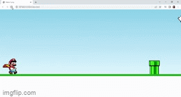

<h1 align="center">🍄 Mario Jump 🍄</h1>

  
Desafio feito por <a href="https://www.youtube.com/@ManualdoDev"><em>Manual do Dev</em></a>

<h3 align="center"> ⚡ Game Mario Jump usando as linguagens: HTML, CSS e JavaScript. ⚡</h3>